Avoidance of Respiratory Viral Infection Scale (ARVIS) development
================

This [R Markdown](http://rmarkdown.rstudio.com) notebook runs the
analyses reported in the Avoidance of Respiratory Virual Infection Scale
(ARVIS) development paper.

The steps performed are:

*Study 1*

1.  Response distribution and item correlation checks
2.  Reliability checks
3.  Exploratory factor analysis
4.  Redundant item removal

*Study 2*

1.  Reliability checks
2.  Confirmatory factor analysis
3.  Factor model revision
4.  Convergent & divergent validity checks
5.  Criterion validity checks

*Study 3* 1. Internal consistency checks 2. Test-retest reliability

## Load packages

``` r
library(tidyverse)
```

    ## -- Attaching packages ---------------------------------------------------------------------------------------------------------------------------------------------------------------------------------- tidyverse 1.3.0 --

    ## v ggplot2 3.3.0     v purrr   0.3.4
    ## v tibble  3.0.1     v dplyr   0.8.5
    ## v tidyr   1.0.2     v stringr 1.4.0
    ## v readr   1.3.1     v forcats 0.5.0

    ## -- Conflicts ------------------------------------------------------------------------------------------------------------------------------------------------------------------------------------- tidyverse_conflicts() --
    ## x dplyr::filter() masks stats::filter()
    ## x dplyr::lag()    masks stats::lag()

``` r
library(corrplot)
```

    ## corrplot 0.84 loaded

``` r
library(psych)
```

    ## 
    ## Attaching package: 'psych'

    ## The following objects are masked from 'package:ggplot2':
    ## 
    ##     %+%, alpha

``` r
library(lavaan)
```

    ## This is lavaan 0.6-6

    ## lavaan is BETA software! Please report any bugs.

    ## 
    ## Attaching package: 'lavaan'

    ## The following object is masked from 'package:psych':
    ## 
    ##     cor2cov

``` r
library(semTable)
library(semPlot)
```

    ## Registered S3 methods overwritten by 'huge':
    ##   method    from   
    ##   plot.sim  BDgraph
    ##   print.sim BDgraph

``` r
library(Hmisc)
```

    ## Loading required package: lattice

    ## Loading required package: survival

    ## Loading required package: Formula

    ## 
    ## Attaching package: 'Hmisc'

    ## The following object is masked from 'package:psych':
    ## 
    ##     describe

    ## The following objects are masked from 'package:dplyr':
    ## 
    ##     src, summarize

    ## The following objects are masked from 'package:base':
    ## 
    ##     format.pval, units

``` r
library(cocor)
library(irr)
```

    ## Loading required package: lpSolve

# Study 1

## Load data

First read in the data

``` r
data <- read.csv('../data/arvis_wide.csv')
```

Next remove any rows with NA and make sure the data is numeric

``` r
data <- data %>% drop_na()
```

## Check data quality

We included an attention check question (instructing subjects to choose
a specific answer) - here we exclude subjects who didn’t pass this

``` r
print(sum(data$Fear_of_everyday_situations452 != 0, na.rm=TRUE))
```

    ## [1] 6

``` r
data <- data %>% subset(data$Fear_of_everyday_situations452 == 0)
```

And remove the attention check question

``` r
data <- data %>% select(-c(Fear_of_everyday_situations452))
write.csv(data, '../data/arvis_wide_clean.csv')
```

## Inspect response distributions

First we need to check that we’re getting non-skewed response
distributions - items are less useful if some responses are rarely being
endorsed.

``` r
data %>% select(contains('Fear_')) %>%
  keep(is.numeric) %>%
  gather() %>%
  ggplot(aes(value)) +
  facet_wrap(~ key, scales = "free") +
  geom_histogram()
```

    ## `stat_bin()` using `bins = 30`. Pick better value with `binwidth`.

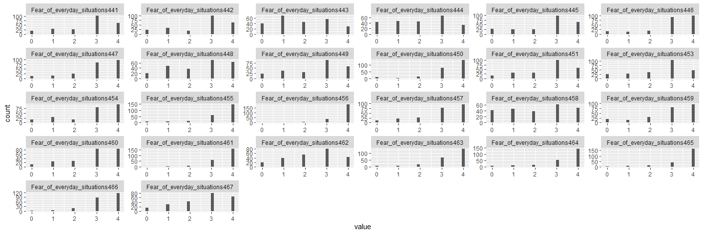<!-- -->

Some items have clearly skewed distributions, with the vast majority of
respondents selecting “strongly agree”. We’ll remove these items next.

``` r
data <- data %>% select(-c('Fear_of_everyday_situations461', "Fear_of_everyday_situations455", "Fear_of_everyday_situations456",
                                 "Fear_of_everyday_situations463", "Fear_of_everyday_situations464", "Fear_of_everyday_situations465",
                                 "Fear_of_everyday_situations466", "Fear_of_everyday_situations450"))
write.csv(data, '../data/ARVIS_wide_cleaned_distributions.csv')
```

## Inspect inter-item correlations

Next we look for items with low correlations with other scale items.

``` r
fear_data <- data %>% select(contains('Fear_')) 
cormat <- round(cor(fear_data),2)

corrplot(cormat, type = "upper", order = "hclust", 
         tl.col = "black", tl.srt = 45)
```

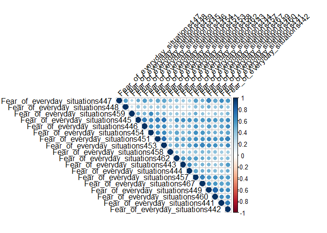<!-- -->

Overall it seems that the items are moderately correlated, which is
good. However some items have fairly low correlations with most other
items, implying that they maybe aren’t measuring quite the same
underlying construct.

Next we remove items that have mean inter-item correlations under .4,
after setting the diagonal to zero.

``` r
diag(cormat) <- 0
rowMeans(cormat) < .4
```

    ## Fear_of_everyday_situations441 Fear_of_everyday_situations442 
    ##                          FALSE                          FALSE 
    ## Fear_of_everyday_situations443 Fear_of_everyday_situations444 
    ##                          FALSE                          FALSE 
    ## Fear_of_everyday_situations445 Fear_of_everyday_situations446 
    ##                          FALSE                          FALSE 
    ## Fear_of_everyday_situations447 Fear_of_everyday_situations448 
    ##                          FALSE                           TRUE 
    ## Fear_of_everyday_situations449 Fear_of_everyday_situations451 
    ##                          FALSE                          FALSE 
    ## Fear_of_everyday_situations453 Fear_of_everyday_situations454 
    ##                          FALSE                          FALSE 
    ## Fear_of_everyday_situations457 Fear_of_everyday_situations458 
    ##                          FALSE                           TRUE 
    ## Fear_of_everyday_situations459 Fear_of_everyday_situations460 
    ##                           TRUE                          FALSE 
    ## Fear_of_everyday_situations462 Fear_of_everyday_situations467 
    ##                          FALSE                          FALSE

``` r
efa_data <- data %>% select(-c('subjectID', 'Fear_of_everyday_situations448', 'Fear_of_everyday_situations458',
                                 'Fear_of_everyday_situations459'))
efa_data <- efa_data %>% select(contains('Fear_'))
```

## Check reliability

We use the `omega` function to check alpha and omega.

``` r
omega(efa_data)
```

    ## Loading required namespace: GPArotation

    ## Warning in fa.stats(r = r, f = f, phi = phi, n.obs = n.obs, np.obs = np.obs, :
    ## The estimated weights for the factor scores are probably incorrect. Try a
    ## different factor score estimation method.

    ## Warning in fac(r = r, nfactors = nfactors, n.obs = n.obs, rotate = rotate, : An
    ## ultra-Heywood case was detected. Examine the results carefully

    ## Warning in cov2cor(t(w) %*% r %*% w): diag(.) had 0 or NA entries; non-finite
    ## result is doubtful

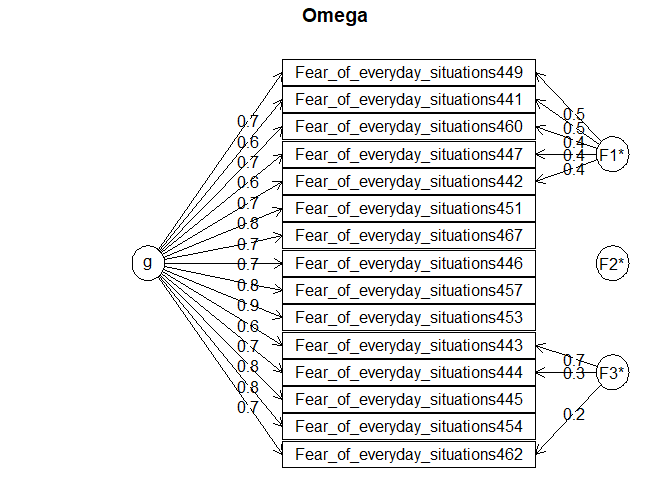<!-- -->

    ## Omega 
    ## Call: omegah(m = m, nfactors = nfactors, fm = fm, key = key, flip = flip, 
    ##     digits = digits, title = title, sl = sl, labels = labels, 
    ##     plot = plot, n.obs = n.obs, rotate = rotate, Phi = Phi, option = option, 
    ##     covar = covar)
    ## Alpha:                 0.95 
    ## G.6:                   0.96 
    ## Omega Hierarchical:    0.88 
    ## Omega H asymptotic:    0.92 
    ## Omega Total            0.96 
    ## 
    ## Schmid Leiman Factor loadings greater than  0.2 
    ##                                   g   F1* F2*   F3*   h2   u2   p2
    ## Fear_of_everyday_situations441 0.63  0.50           0.64 0.36 0.61
    ## Fear_of_everyday_situations442 0.71  0.37           0.66 0.34 0.76
    ## Fear_of_everyday_situations443 0.61            0.69 0.85 0.15 0.44
    ## Fear_of_everyday_situations444 0.66            0.32 0.54 0.46 0.81
    ## Fear_of_everyday_situations445 0.83                 0.72 0.28 0.96
    ## Fear_of_everyday_situations446 0.73                 0.55 0.45 0.97
    ## Fear_of_everyday_situations447 0.61  0.42           0.55 0.45 0.68
    ## Fear_of_everyday_situations449 0.69  0.53           0.76 0.24 0.63
    ## Fear_of_everyday_situations451 0.82                 0.69 0.31 0.97
    ## Fear_of_everyday_situations453 0.85                 0.73 0.27 1.00
    ## Fear_of_everyday_situations454 0.78                 0.61 0.39 1.00
    ## Fear_of_everyday_situations457 0.78                 0.62 0.38 0.98
    ## Fear_of_everyday_situations460 0.67  0.44           0.65 0.35 0.70
    ## Fear_of_everyday_situations462 0.68            0.20 0.52 0.48 0.91
    ## Fear_of_everyday_situations467 0.73                 0.55 0.45 0.97
    ## 
    ## With eigenvalues of:
    ##    g  F1*  F2*  F3* 
    ## 7.84 1.12 0.00 0.68 
    ## 
    ## general/max  7.03   max/min =   Inf
    ## mean percent general =  0.83    with sd =  0.18 and cv of  0.22 
    ## Explained Common Variance of the general factor =  0.81 
    ## 
    ## The degrees of freedom are 63  and the fit is  0.84 
    ## The number of observations was  236  with Chi Square =  191.1  with prob <  7.9e-15
    ## The root mean square of the residuals is  0.03 
    ## The df corrected root mean square of the residuals is  0.04
    ## RMSEA index =  0.093  and the 10 % confidence intervals are  0.078 0.108
    ## BIC =  -153.12
    ## 
    ## Compare this with the adequacy of just a general factor and no group factors
    ## The degrees of freedom for just the general factor are 90  and the fit is  1.87 
    ## The number of observations was  236  with Chi Square =  427.79  with prob <  2e-45
    ## The root mean square of the residuals is  0.08 
    ## The df corrected root mean square of the residuals is  0.09 
    ## 
    ## RMSEA index =  0.126  and the 10 % confidence intervals are  0.114 0.139
    ## BIC =  -63.96 
    ## 
    ## Measures of factor score adequacy             
    ##                                                  g  F1* F2*  F3*
    ## Correlation of scores with factors            0.96 0.82   0 0.86
    ## Multiple R square of scores with factors      0.93 0.68   0 0.75
    ## Minimum correlation of factor score estimates 0.86 0.36  -1 0.50
    ## 
    ##  Total, General and Subset omega for each subset
    ##                                                  g  F1* F2*  F3*
    ## Omega total for total scores and subscales    0.96 0.94  NA 0.89
    ## Omega general for total scores and subscales  0.88 0.82  NA 0.78
    ## Omega group for total scores and subscales    0.07 0.12  NA 0.11

This looks good, with \(\alpha\) = 0.95 and \(\omega\) = 0.96. However,
this could be cause for some concern as very high internal consistency
values may suggest some items are redundant.

## Exploratory factor analysis

Before performing factor analysis, we first use Barlett’s test of
sphericity to check that the data is appropriate for EFA.

``` r
cortest.bartlett(efa_data)
```

    ## R was not square, finding R from data

    ## $chisq
    ## [1] 2569.438
    ## 
    ## $p.value
    ## [1] 0
    ## 
    ## $df
    ## [1] 105

This is significant, which is good\!

Next, we fit the FA model using maximum likelihood and use parallel
analysis to determine the number of factors.

``` r
parallel = fa.parallel(efa_data, fm='ml', fa='fa', n.iter=100, SMC=TRUE,  quant=.95)
```

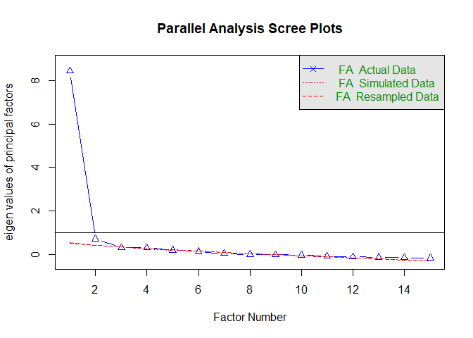<!-- -->

    ## Parallel analysis suggests that the number of factors =  2  and the number of components =  NA

``` r
parallel_df <- data.frame(real_values = parallel$fa.values, sim_values = parallel$fa.sim)
write.csv(parallel_df, '../data/parallel_analysis_T1.csv', row.names = FALSE)
```

This suggests that the optimal number of factors is two. However it’s
best to seek additional evidence for this. To do this, we fit models
with 1, 2, and 3 factors and inspect model fit statistics.

``` r
fa_model_1f <- fa(efa_data, nfactors=1, fm="ml", rotate='oblimin')
fa_model_2f <- fa(efa_data, nfactors=2, fm="ml", rotate='oblimin')
fa_model_3f <- fa(efa_data, nfactors=3, fm="ml", rotate='oblimin')
```

And then check the BIC, a model fit index that penalises according to
model complexity

``` r
fa_model_1f$BIC
```

    ## [1] -103.7879

``` r
fa_model_2f$BIC
```

    ## [1] -178.1318

``` r
fa_model_3f$BIC
```

    ## [1] -158.2232

We also check the RMSEA of the two-factor model to ensure the fit is
good

``` r
fa_model_2f$RMSEA
```

    ##      RMSEA      lower      upper confidence 
    ## 0.09468362 0.08144107 0.10879697 0.90000000

This suggests a 3 factor model provides the best fit (although CIs
ovelap), but the 2 factor model is still “good”. The RMSEA does not
account for model complexity, and is therefore more susceptible to
over-valuing models that overfit the data.

## Trim items

We next remove items that don’t load cleanly on to either of these two
factors (showing a \<.4 difference between loadings on to Factors 1 and
2), as these items likely have low discriminative validity.

``` r
fa_model_2f$loadings
```

    ## 
    ## Loadings:
    ##                                ML1    ML2   
    ## Fear_of_everyday_situations441  0.165  0.623
    ## Fear_of_everyday_situations442  0.437  0.402
    ## Fear_of_everyday_situations443  0.766 -0.102
    ## Fear_of_everyday_situations444  0.766       
    ## Fear_of_everyday_situations445  0.853       
    ## Fear_of_everyday_situations446  0.674       
    ## Fear_of_everyday_situations447  0.141  0.601
    ## Fear_of_everyday_situations449         0.923
    ## Fear_of_everyday_situations451  0.680  0.187
    ## Fear_of_everyday_situations453  0.755  0.110
    ## Fear_of_everyday_situations454  0.759       
    ## Fear_of_everyday_situations457  0.567  0.234
    ## Fear_of_everyday_situations460         0.851
    ## Fear_of_everyday_situations462  0.784 -0.116
    ## Fear_of_everyday_situations467  0.495  0.280
    ## 
    ##                  ML1   ML2
    ## SS loadings    5.383 2.710
    ## Proportion Var 0.359 0.181
    ## Cumulative Var 0.359 0.540

``` r
write.csv(data.frame(unclass(fa_model_2f$loadings)), '../data/fa_model_2f_A_loadings.csv')
```

``` r
# Remove items with cross loadings (<.3 difference between factors)
efa_data <- efa_data %>% select(-c('Fear_of_everyday_situations442', 'Fear_of_everyday_situations457',
                                       'Fear_of_everyday_situations467'))
```

We then check reliability again to make sure this hasn’t had a negative
effect.

``` r
omega(efa_data)
```

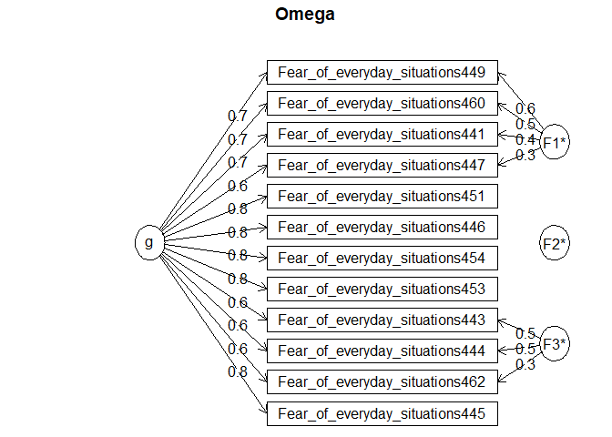<!-- -->

    ## Omega 
    ## Call: omegah(m = m, nfactors = nfactors, fm = fm, key = key, flip = flip, 
    ##     digits = digits, title = title, sl = sl, labels = labels, 
    ##     plot = plot, n.obs = n.obs, rotate = rotate, Phi = Phi, option = option, 
    ##     covar = covar)
    ## Alpha:                 0.94 
    ## G.6:                   0.94 
    ## Omega Hierarchical:    0.86 
    ## Omega H asymptotic:    0.91 
    ## Omega Total            0.95 
    ## 
    ## Schmid Leiman Factor loadings greater than  0.2 
    ##                                   g   F1*   F2*   F3*   h2   u2   p2
    ## Fear_of_everyday_situations441 0.66  0.38             0.58 0.42 0.75
    ## Fear_of_everyday_situations443 0.60              0.51 0.62 0.38 0.58
    ## Fear_of_everyday_situations444 0.61              0.49 0.61 0.39 0.61
    ## Fear_of_everyday_situations445 0.84                   0.75 0.25 0.94
    ## Fear_of_everyday_situations446 0.78                   0.62 0.38 0.97
    ## Fear_of_everyday_situations447 0.64  0.34             0.54 0.46 0.76
    ## Fear_of_everyday_situations449 0.69  0.64             0.89 0.11 0.54
    ## Fear_of_everyday_situations451 0.82                   0.69 0.31 0.96
    ## Fear_of_everyday_situations453 0.83                   0.71 0.29 0.98
    ## Fear_of_everyday_situations454 0.75                   0.58 0.42 0.97
    ## Fear_of_everyday_situations460 0.66  0.49             0.67 0.33 0.64
    ## Fear_of_everyday_situations462 0.64              0.33 0.52 0.48 0.79
    ## 
    ## With eigenvalues of:
    ##    g  F1*  F2*  F3* 
    ## 6.12 0.93 0.06 0.66 
    ## 
    ## general/max  6.59   max/min =   14.66
    ## mean percent general =  0.79    with sd =  0.17 and cv of  0.21 
    ## Explained Common Variance of the general factor =  0.79 
    ## 
    ## The degrees of freedom are 33  and the fit is  0.38 
    ## The number of observations was  236  with Chi Square =  87.17  with prob <  8.9e-07
    ## The root mean square of the residuals is  0.03 
    ## The df corrected root mean square of the residuals is  0.04
    ## RMSEA index =  0.083  and the 10 % confidence intervals are  0.062 0.105
    ## BIC =  -93.14
    ## 
    ## Compare this with the adequacy of just a general factor and no group factors
    ## The degrees of freedom for just the general factor are 54  and the fit is  1.35 
    ## The number of observations was  236  with Chi Square =  309.35  with prob <  1.7e-37
    ## The root mean square of the residuals is  0.09 
    ## The df corrected root mean square of the residuals is  0.1 
    ## 
    ## RMSEA index =  0.141  and the 10 % confidence intervals are  0.127 0.157
    ## BIC =  14.31 
    ## 
    ## Measures of factor score adequacy             
    ##                                                  g  F1*   F2*  F3*
    ## Correlation of scores with factors            0.95 0.86  0.20 0.73
    ## Multiple R square of scores with factors      0.90 0.74  0.04 0.54
    ## Minimum correlation of factor score estimates 0.80 0.47 -0.92 0.08
    ## 
    ##  Total, General and Subset omega for each subset
    ##                                                  g  F1*  F2*  F3*
    ## Omega total for total scores and subscales    0.95 0.90 0.84 0.86
    ## Omega general for total scores and subscales  0.86 0.68 0.83 0.65
    ## Omega group for total scores and subscales    0.07 0.22 0.02 0.21

This still demonstrates high \(\alpha\) and \(\omega\).

We then rerun the EFA and check we still get two factors

``` r
parallel = fa.parallel(efa_data, fm='ml', fa='fa', n.iter=100, SMC=TRUE,  quant=.95)
```

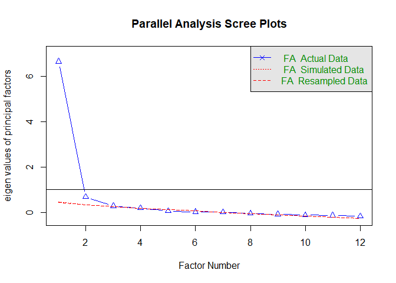<!-- -->

    ## Parallel analysis suggests that the number of factors =  2  and the number of components =  NA

The parallel analysis still indicates two factors

``` r
fa_model_2f <- fa(efa_data, nfactors=2, fm="ml", rotate='oblimin')
fa_model_2f
```

    ## Factor Analysis using method =  ml
    ## Call: fa(r = efa_data, nfactors = 2, rotate = "oblimin", fm = "ml")
    ## Standardized loadings (pattern matrix) based upon correlation matrix
    ##                                  ML1   ML2   h2   u2 com
    ## Fear_of_everyday_situations441  0.22  0.55 0.54 0.46 1.3
    ## Fear_of_everyday_situations443  0.75 -0.08 0.47 0.53 1.0
    ## Fear_of_everyday_situations444  0.72 -0.05 0.47 0.53 1.0
    ## Fear_of_everyday_situations445  0.88 -0.01 0.76 0.24 1.0
    ## Fear_of_everyday_situations446  0.69  0.08 0.57 0.43 1.0
    ## Fear_of_everyday_situations447  0.16  0.58 0.50 0.50 1.2
    ## Fear_of_everyday_situations449 -0.05  0.97 0.88 0.12 1.0
    ## Fear_of_everyday_situations451  0.69  0.18 0.69 0.31 1.1
    ## Fear_of_everyday_situations453  0.75  0.11 0.70 0.30 1.0
    ## Fear_of_everyday_situations454  0.75 -0.01 0.55 0.45 1.0
    ## Fear_of_everyday_situations460  0.04  0.82 0.71 0.29 1.0
    ## Fear_of_everyday_situations462  0.75 -0.08 0.48 0.52 1.0
    ## 
    ##                        ML1  ML2
    ## SS loadings           4.78 2.54
    ## Proportion Var        0.40 0.21
    ## Cumulative Var        0.40 0.61
    ## Proportion Explained  0.65 0.35
    ## Cumulative Proportion 0.65 1.00
    ## 
    ##  With factor correlations of 
    ##      ML1  ML2
    ## ML1 1.00 0.76
    ## ML2 0.76 1.00
    ## 
    ## Mean item complexity =  1.1
    ## Test of the hypothesis that 2 factors are sufficient.
    ## 
    ## The degrees of freedom for the null model are  66  and the objective function was  8.34 with Chi Square of  1918.52
    ## The degrees of freedom for the model are 43  and the objective function was  0.58 
    ## 
    ## The root mean square of the residuals (RMSR) is  0.04 
    ## The df corrected root mean square of the residuals is  0.05 
    ## 
    ## The harmonic number of observations is  236 with the empirical chi square  51.97  with prob <  0.16 
    ## The total number of observations was  236  with Likelihood Chi Square =  133.32  with prob <  3.6e-11 
    ## 
    ## Tucker Lewis Index of factoring reliability =  0.925
    ## RMSEA index =  0.094  and the 90 % confidence intervals are  0.077 0.113
    ## BIC =  -101.63
    ## Fit based upon off diagonal values = 0.99
    ## Measures of factor score adequacy             
    ##                                                    ML1  ML2
    ## Correlation of (regression) scores with factors   0.97 0.96
    ## Multiple R square of scores with factors          0.93 0.93
    ## Minimum correlation of possible factor scores     0.86 0.85

Finally, we look at whether we can remove items with lower loadings and
retain high reliability. First, this makes the measure shorter and hence
quicker to complete. Second, the reliability estimates are very high
which might suggest redundancy in the items.

The first factor has 7 items loading on to it, while the second has 4.
We take the weakest 3 items primarily loading on to the first factor and
remove them so we end up with 4 items loading primarily on to each
factor.

``` r
fa_model_2f$loadings
```

    ## 
    ## Loadings:
    ##                                ML1    ML2   
    ## Fear_of_everyday_situations441  0.216  0.554
    ## Fear_of_everyday_situations443  0.745       
    ## Fear_of_everyday_situations444  0.724       
    ## Fear_of_everyday_situations445  0.879       
    ## Fear_of_everyday_situations446  0.694       
    ## Fear_of_everyday_situations447  0.160  0.578
    ## Fear_of_everyday_situations449         0.973
    ## Fear_of_everyday_situations451  0.686  0.180
    ## Fear_of_everyday_situations453  0.750  0.113
    ## Fear_of_everyday_situations454  0.749       
    ## Fear_of_everyday_situations460         0.818
    ## Fear_of_everyday_situations462  0.749       
    ## 
    ##                  ML1   ML2
    ## SS loadings    4.567 2.323
    ## Proportion Var 0.381 0.194
    ## Cumulative Var 0.381 0.574

``` r
reduced_data <- efa_data %>% select(c('Fear_of_everyday_situations441', 'Fear_of_everyday_situations447', 'Fear_of_everyday_situations449',
                                        'Fear_of_everyday_situations460',
                                        'Fear_of_everyday_situations445', 'Fear_of_everyday_situations453', 'Fear_of_everyday_situations454',
                                        'Fear_of_everyday_situations462'))
```

Then we check reliability

``` r
omega(reduced_data)
```

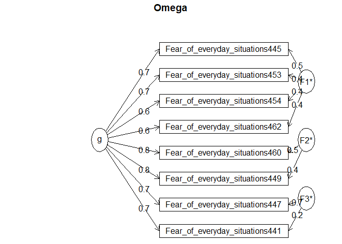<!-- -->

    ## Omega 
    ## Call: omegah(m = m, nfactors = nfactors, fm = fm, key = key, flip = flip, 
    ##     digits = digits, title = title, sl = sl, labels = labels, 
    ##     plot = plot, n.obs = n.obs, rotate = rotate, Phi = Phi, option = option, 
    ##     covar = covar)
    ## Alpha:                 0.91 
    ## G.6:                   0.92 
    ## Omega Hierarchical:    0.81 
    ## Omega H asymptotic:    0.86 
    ## Omega Total            0.94 
    ## 
    ## Schmid Leiman Factor loadings greater than  0.2 
    ##                                   g   F1*   F2*   F3*   h2   u2   p2
    ## Fear_of_everyday_situations441 0.68        0.20  0.21 0.55 0.45 0.84
    ## Fear_of_everyday_situations447 0.70              0.71 1.00 0.00 0.50
    ## Fear_of_everyday_situations449 0.80        0.37       0.79 0.21 0.80
    ## Fear_of_everyday_situations460 0.79        0.48       0.86 0.14 0.73
    ## Fear_of_everyday_situations445 0.74  0.45             0.75 0.25 0.73
    ## Fear_of_everyday_situations453 0.73  0.40             0.70 0.30 0.77
    ## Fear_of_everyday_situations454 0.64  0.40             0.57 0.43 0.72
    ## Fear_of_everyday_situations462 0.56  0.36             0.45 0.55 0.70
    ## 
    ## With eigenvalues of:
    ##    g  F1*  F2*  F3* 
    ## 4.03 0.66 0.41 0.57 
    ## 
    ## general/max  6.11   max/min =   1.61
    ## mean percent general =  0.72    with sd =  0.1 and cv of  0.14 
    ## Explained Common Variance of the general factor =  0.71 
    ## 
    ## The degrees of freedom are 7  and the fit is  0.06 
    ## The number of observations was  236  with Chi Square =  14.56  with prob <  0.042
    ## The root mean square of the residuals is  0.02 
    ## The df corrected root mean square of the residuals is  0.03
    ## RMSEA index =  0.068  and the 10 % confidence intervals are  0.012 0.117
    ## BIC =  -23.68
    ## 
    ## Compare this with the adequacy of just a general factor and no group factors
    ## The degrees of freedom for just the general factor are 20  and the fit is  0.77 
    ## The number of observations was  236  with Chi Square =  177.87  with prob <  2.5e-27
    ## The root mean square of the residuals is  0.09 
    ## The df corrected root mean square of the residuals is  0.11 
    ## 
    ## RMSEA index =  0.183  and the 10 % confidence intervals are  0.159 0.208
    ## BIC =  68.59 
    ## 
    ## Measures of factor score adequacy             
    ##                                                  g   F1*   F2*  F3*
    ## Correlation of scores with factors            0.91  0.67  0.67 0.91
    ## Multiple R square of scores with factors      0.83  0.45  0.45 0.83
    ## Minimum correlation of factor score estimates 0.66 -0.10 -0.11 0.67
    ## 
    ##  Total, General and Subset omega for each subset
    ##                                                  g  F1* F2*  F3*
    ## Omega total for total scores and subscales    0.94 0.86 0.9 0.85
    ## Omega general for total scores and subscales  0.81 0.63 0.7 0.59
    ## Omega group for total scores and subscales    0.11 0.23 0.2 0.26

The values of \(\alpha\) and \(\omega\) have reduced slightly, but are
still high, as expected.

We then check that the same factor structure emerges.

``` r
parallel = fa.parallel(reduced_data, fm='ml', fa='fa', n.iter=100, SMC=TRUE,  quant=.95)
```

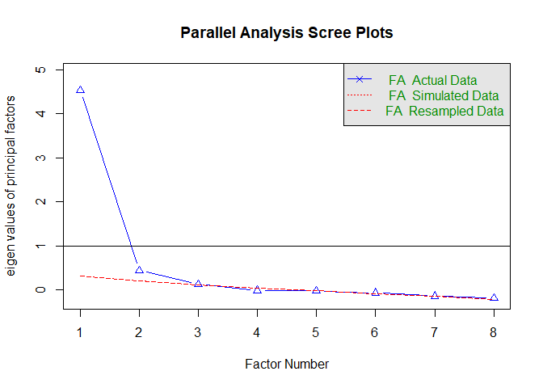<!-- -->

    ## Parallel analysis suggests that the number of factors =  2  and the number of components =  NA

This still suggests 2 factors.

``` r
fa_model_2f_reduced <- fa(reduced_data, nfactors=2, fm="ml", rotate='oblimin')

fa_model_2f_reduced
```

    ## Factor Analysis using method =  ml
    ## Call: fa(r = reduced_data, nfactors = 2, rotate = "oblimin", fm = "ml")
    ## Standardized loadings (pattern matrix) based upon correlation matrix
    ##                                  ML2   ML1   h2    u2 com
    ## Fear_of_everyday_situations441  0.23  0.53 0.52 0.482 1.4
    ## Fear_of_everyday_situations447  0.18  0.56 0.50 0.503 1.2
    ## Fear_of_everyday_situations449 -0.07  1.01 0.91 0.094 1.0
    ## Fear_of_everyday_situations460  0.09  0.77 0.71 0.294 1.0
    ## Fear_of_everyday_situations445  0.86  0.01 0.75 0.252 1.0
    ## Fear_of_everyday_situations453  0.77  0.09 0.71 0.290 1.0
    ## Fear_of_everyday_situations454  0.78 -0.04 0.56 0.439 1.0
    ## Fear_of_everyday_situations462  0.69 -0.03 0.45 0.552 1.0
    ## 
    ##                        ML2  ML1
    ## SS loadings           2.69 2.40
    ## Proportion Var        0.34 0.30
    ## Cumulative Var        0.34 0.64
    ## Proportion Explained  0.53 0.47
    ## Cumulative Proportion 0.53 1.00
    ## 
    ##  With factor correlations of 
    ##      ML2  ML1
    ## ML2 1.00 0.76
    ## ML1 0.76 1.00
    ## 
    ## Mean item complexity =  1.1
    ## Test of the hypothesis that 2 factors are sufficient.
    ## 
    ## The degrees of freedom for the null model are  28  and the objective function was  5.02 with Chi Square of  1161.55
    ## The degrees of freedom for the model are 13  and the objective function was  0.19 
    ## 
    ## The root mean square of the residuals (RMSR) is  0.03 
    ## The df corrected root mean square of the residuals is  0.05 
    ## 
    ## The harmonic number of observations is  236 with the empirical chi square  14.51  with prob <  0.34 
    ## The total number of observations was  236  with Likelihood Chi Square =  44.05  with prob <  3e-05 
    ## 
    ## Tucker Lewis Index of factoring reliability =  0.941
    ## RMSEA index =  0.101  and the 90 % confidence intervals are  0.069 0.134
    ## BIC =  -26.98
    ## Fit based upon off diagonal values = 1
    ## Measures of factor score adequacy             
    ##                                                    ML2  ML1
    ## Correlation of (regression) scores with factors   0.95 0.97
    ## Multiple R square of scores with factors          0.90 0.94
    ## Minimum correlation of possible factor scores     0.79 0.88

One thing to note here is that the factors are highly correlated (r =
.76), which could indicates a large degree of overlap.

Finally, we can plot a diagram illustrating the factor structure

``` r
fa.diagram(fa_model_2f_reduced)
```

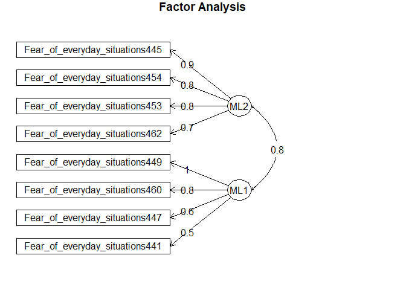<!-- -->

# Study 2

## Load data

``` r
validation_data <- read.csv('../data/arvis_wide_sample2.csv')
validation_data <- validation_data %>% drop_na()
```

## Exclude subjects who fail attention check

``` r
print(sum(validation_data$Fear_of_everyday_situations452 != 0, na.rm=TRUE))
```

    ## [1] 9

``` r
validation_data <- validation_data %>% subset(validation_data$Fear_of_everyday_situations452 == 0)
validation_data <- validation_data %>% select(-c(Fear_of_everyday_situations452))
```

## Check reliability

Here we select the 8 items we settled on in Study 1 and check their
reliability in this sample

``` r
omega(validation_data %>% select(c('Fear_of_everyday_situations441', 'Fear_of_everyday_situations447', 'Fear_of_everyday_situations449',
                                        'Fear_of_everyday_situations460',
                                        'Fear_of_everyday_situations445', 'Fear_of_everyday_situations453', 'Fear_of_everyday_situations454',
                                        'Fear_of_everyday_situations462')))
```

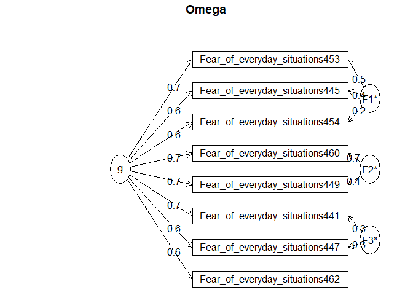<!-- -->

    ## Omega 
    ## Call: omegah(m = m, nfactors = nfactors, fm = fm, key = key, flip = flip, 
    ##     digits = digits, title = title, sl = sl, labels = labels, 
    ##     plot = plot, n.obs = n.obs, rotate = rotate, Phi = Phi, option = option, 
    ##     covar = covar)
    ## Alpha:                 0.89 
    ## G.6:                   0.89 
    ## Omega Hierarchical:    0.79 
    ## Omega H asymptotic:    0.87 
    ## Omega Total            0.91 
    ## 
    ## Schmid Leiman Factor loadings greater than  0.2 
    ##                                   g   F1*   F2*   F3*   h2   u2   p2
    ## Fear_of_everyday_situations441 0.67              0.33 0.57 0.43 0.80
    ## Fear_of_everyday_situations447 0.63              0.29 0.49 0.51 0.82
    ## Fear_of_everyday_situations449 0.67        0.37       0.59 0.41 0.74
    ## Fear_of_everyday_situations460 0.71        0.70       1.00 0.00 0.51
    ## Fear_of_everyday_situations445 0.64  0.37             0.54 0.46 0.74
    ## Fear_of_everyday_situations453 0.73  0.47             0.76 0.24 0.70
    ## Fear_of_everyday_situations454 0.64  0.23             0.48 0.52 0.86
    ## Fear_of_everyday_situations462 0.63              0.20 0.47 0.53 0.85
    ## 
    ## With eigenvalues of:
    ##    g  F1*  F2*  F3* 
    ## 3.56 0.45 0.64 0.26 
    ## 
    ## general/max  5.59   max/min =   2.45
    ## mean percent general =  0.75    with sd =  0.11 and cv of  0.15 
    ## Explained Common Variance of the general factor =  0.73 
    ## 
    ## The degrees of freedom are 7  and the fit is  0.04 
    ## The number of observations was  341  with Chi Square =  13.54  with prob <  0.06
    ## The root mean square of the residuals is  0.02 
    ## The df corrected root mean square of the residuals is  0.04
    ## RMSEA index =  0.052  and the 10 % confidence intervals are  0 0.094
    ## BIC =  -27.28
    ## 
    ## Compare this with the adequacy of just a general factor and no group factors
    ## The degrees of freedom for just the general factor are 20  and the fit is  0.46 
    ## The number of observations was  341  with Chi Square =  152.87  with prob <  1.8e-22
    ## The root mean square of the residuals is  0.08 
    ## The df corrected root mean square of the residuals is  0.09 
    ## 
    ## RMSEA index =  0.14  and the 10 % confidence intervals are  0.12 0.161
    ## BIC =  36.23 
    ## 
    ## Measures of factor score adequacy             
    ##                                                  g   F1*  F2*   F3*
    ## Correlation of scores with factors            0.89  0.63 0.89  0.50
    ## Multiple R square of scores with factors      0.80  0.39 0.78  0.25
    ## Minimum correlation of factor score estimates 0.60 -0.22 0.57 -0.50
    ## 
    ##  Total, General and Subset omega for each subset
    ##                                                  g  F1*  F2*  F3*
    ## Omega total for total scores and subscales    0.91 0.81 0.88 0.75
    ## Omega general for total scores and subscales  0.79 0.63 0.55 0.64
    ## Omega group for total scores and subscales    0.08 0.18 0.33 0.11

Here \(\alpha\) = .89 and \(\omega\) = .91, so this looks good.

## Confirmatory factor analysis

Next, we use the factor structure identified in Study 1 and examine how
well it fits the data from Study 2. We also compare this against a
single factor solution, given that the factors were highly correlated.

``` r
fa_structure_2f <- "
Others =~ Fear_of_everyday_situations445 + Fear_of_everyday_situations453 + Fear_of_everyday_situations454 + Fear_of_everyday_situations462
Infection =~ Fear_of_everyday_situations441 + Fear_of_everyday_situations447 + Fear_of_everyday_situations449 + Fear_of_everyday_situations460
"

fa_structure_1f <- "
ARVIS =~ Fear_of_everyday_situations445 + Fear_of_everyday_situations453 + Fear_of_everyday_situations454 + Fear_of_everyday_situations462 +
Fear_of_everyday_situations441 + Fear_of_everyday_situations447 + Fear_of_everyday_situations449 + Fear_of_everyday_situations460
"
```

``` r
cfa_fit_1f <- cfa(fa_structure_1f, data = validation_data, std.lv = TRUE)
cfa_fit_2f <- cfa(fa_structure_2f, data = validation_data, std.lv = TRUE)
```

Here is an illustration of the fitted two factor model, for comparison
with the EFA model in Study 1

``` r
semPaths(cfa_fit_2f, what = "std", whatLabels = "std", 
         residuals = TRUE, intercepts = FALSE,
         # prettify
         fade = TRUE, sizeMan=3, layout='tree', rotation=4, curve=2,
         style = "lisrel", sizeLat = 8, 
         nCharNodes = 50, 
         edge.label.cex = 0.5, edge.color='#4a4a4a',
         color = list(lat = rgb(219, 219, 219, maxColorValue = 255), 
                      man = rgb(117, 188, 255, maxColorValue = 255)))
```

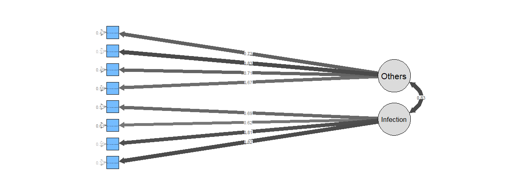<!-- -->

The individual items all load fairly strongly onto their respective
factors, which is good. However there is a high degree of correlation
between factors (.82).

We can then evaluate the fit of the one and two factor model.

``` r
compareLavaan(c('One factor' = cfa_fit_1f, 'Two factor' = cfa_fit_2f))
```

    ##              chisq df pvalue rmsea   cfi   tli  srmr      aic      bic dchi ddf
    ## Two factor  83.845 19      0 0.100 0.948 0.924 0.048 7192.763 7257.905    -   -
    ## One factor 138.605 20      0 0.132 0.905 0.868 0.051 7245.523 7306.833    -   -
    ##            npval
    ## Two factor     -
    ## One factor     -

This indicates that the two factor model provides the best fit, however
the fit of this model could be a lot better. For example, RMSEA is .10,
which is the generally accepted cutoff for an acceptable model fit.
Other metrics are better, but not excellent (e.g. CFI \> .9 but not \>
.95).

To see if we can improve things, we take a look at the modification
indices. This suggests way in which the model can be modified to improve
fit.

``` r
modificationIndices(cfa_fit_2f, sort.=TRUE, minimum.value=3)
```

    ##                               lhs op                            rhs     mi
    ## 55 Fear_of_everyday_situations449 ~~ Fear_of_everyday_situations460 56.076
    ## 28 Fear_of_everyday_situations445 ~~ Fear_of_everyday_situations453 17.590
    ## 50 Fear_of_everyday_situations441 ~~ Fear_of_everyday_situations447 16.811
    ## 21                         Others =~ Fear_of_everyday_situations447 15.920
    ## 54 Fear_of_everyday_situations447 ~~ Fear_of_everyday_situations460 14.417
    ## 53 Fear_of_everyday_situations447 ~~ Fear_of_everyday_situations449  9.312
    ## 22                         Others =~ Fear_of_everyday_situations449  7.167
    ## 51 Fear_of_everyday_situations441 ~~ Fear_of_everyday_situations449  6.969
    ## 29 Fear_of_everyday_situations445 ~~ Fear_of_everyday_situations454  6.312
    ## 41 Fear_of_everyday_situations454 ~~ Fear_of_everyday_situations462  6.167
    ## 46 Fear_of_everyday_situations462 ~~ Fear_of_everyday_situations441  6.105
    ## 36 Fear_of_everyday_situations453 ~~ Fear_of_everyday_situations462  5.708
    ## 52 Fear_of_everyday_situations441 ~~ Fear_of_everyday_situations460  5.312
    ## 23                         Others =~ Fear_of_everyday_situations460  5.105
    ## 20                         Others =~ Fear_of_everyday_situations441  4.846
    ## 32 Fear_of_everyday_situations445 ~~ Fear_of_everyday_situations447  4.601
    ## 49 Fear_of_everyday_situations462 ~~ Fear_of_everyday_situations460  4.144
    ## 47 Fear_of_everyday_situations462 ~~ Fear_of_everyday_situations447  3.137
    ##       epc sepc.lv sepc.all sepc.nox
    ## 55  0.306   0.306    0.800    0.800
    ## 28  0.216   0.216    0.376    0.376
    ## 50  0.159   0.159    0.258    0.258
    ## 21  0.469   0.469    0.478    0.478
    ## 54 -0.127  -0.127   -0.284   -0.284
    ## 53 -0.112  -0.112   -0.221   -0.221
    ## 22 -0.356  -0.356   -0.318   -0.318
    ## 51 -0.108  -0.108   -0.204   -0.204
    ## 29 -0.123  -0.123   -0.177   -0.177
    ## 41  0.114   0.114    0.166    0.166
    ## 46  0.105   0.105    0.152    0.152
    ## 36 -0.112  -0.112   -0.196   -0.196
    ## 52 -0.087  -0.087   -0.184   -0.184
    ## 23 -0.278  -0.278   -0.271   -0.271
    ## 20  0.285   0.285    0.257    0.257
    ## 32  0.087   0.087    0.132    0.132
    ## 49 -0.070  -0.070   -0.139   -0.139
    ## 47  0.070   0.070    0.107    0.107

The highest scoring term identified here is covarying erors between two
of the items, indicating that that accounting for this error covariance
in the model would improve fit substantially.

We then try to fit this model, and a one factor model with this error
covariance term added

``` r
fa_structure_1f_cov <- "
ARVIS =~ Fear_of_everyday_situations445 + Fear_of_everyday_situations453 + Fear_of_everyday_situations454 + Fear_of_everyday_situations462 +
Fear_of_everyday_situations441 + Fear_of_everyday_situations447 + Fear_of_everyday_situations449 + Fear_of_everyday_situations460
Fear_of_everyday_situations449 ~~ Fear_of_everyday_situations460
"

fa_structure_2f_cov <- "
Others =~ Fear_of_everyday_situations445 + Fear_of_everyday_situations453 + Fear_of_everyday_situations454 + Fear_of_everyday_situations462
Infection =~ Fear_of_everyday_situations441 + Fear_of_everyday_situations447 + Fear_of_everyday_situations449 + Fear_of_everyday_situations460
Fear_of_everyday_situations449 ~~ Fear_of_everyday_situations460
"
```

``` r
cfa_fit_1f_cov <- cfa(fa_structure_1f_cov, data = validation_data, std.lv = TRUE)
cfa_fit_2f_cov <- cfa(fa_structure_2f_cov, data = validation_data, std.lv = TRUE)
```

And we can then evaluate the fit of these two models relative to the
previous one

``` r
comparison_cov <- compareLavaan(c('One factor' = cfa_fit_1f, 'One factor, covariance term' = cfa_fit_1f_cov, 'Two factor' = cfa_fit_2f, 'Two factor, covariance term' = cfa_fit_2f_cov))
```

    ##                               chisq df pvalue rmsea   cfi   tli  srmr      aic
    ## Two factor, covariance term  36.359 18  0.006 0.055 0.985 0.977 0.028 7147.276
    ## One factor, covariance term  55.769 19  0.000 0.075 0.971 0.957 0.035 7164.686
    ## Two factor                   83.845 19  0.000 0.100 0.948 0.924 0.048 7192.763
    ## One factor                  138.605 20  0.000 0.132 0.905 0.868 0.051 7245.523
    ##                                  bic dchi ddf npval
    ## Two factor, covariance term 7216.250    -   -     -
    ## One factor, covariance term 7229.828    -   -     -
    ## Two factor                  7257.905    -   -     -
    ## One factor                  7306.833    -   -     -

``` r
comparison_cov
```

    ##                               chisq df pvalue rmsea   cfi   tli  srmr      aic
    ## Two factor, covariance term  36.359 18  0.006 0.055 0.985 0.977 0.028 7147.276
    ## One factor, covariance term  55.769 19  0.000 0.075 0.971 0.957 0.035 7164.686
    ## Two factor                   83.845 19  0.000 0.100 0.948 0.924 0.048 7192.763
    ## One factor                  138.605 20  0.000 0.132 0.905 0.868 0.051 7245.523
    ##                                  bic dchi ddf npval
    ## Two factor, covariance term 7216.250    -   -     -
    ## One factor, covariance term 7229.828    -   -     -
    ## Two factor                  7257.905    -   -     -
    ## One factor                  7306.833    -   -     -

``` r
write.csv(comparison_cov, '../data/comparison_cov.csv')
```

This clearly shows that the model fit has improved by including this
term. All fit indices are now excellent (RMSEA \< .08, CFI \> .95, SRMR
\< .05, \(\chi^2\) almost non-significant).

However this model isn’t ideal - it’s generally not good to have to
include covarying errors unless this is theoretically motivated. This
indicates that two of our items are likely highly correlated and
therefore redundant, which suggests that simply removing one of them may
have a beneficial effect, and mean we can avoid modelling the covariance
between them.

We can try this to see how it affects model fit. We’ll remove item 460
as it has the lowest loading.

``` r
fa_structure_2f <- "
Others =~ Fear_of_everyday_situations445 + Fear_of_everyday_situations453 + Fear_of_everyday_situations454 + Fear_of_everyday_situations462
Infection =~ Fear_of_everyday_situations441 + Fear_of_everyday_situations447 + Fear_of_everyday_situations449
"


fa_structure_1f <- "
ARVIS =~ Fear_of_everyday_situations445 + Fear_of_everyday_situations453 + Fear_of_everyday_situations454 + Fear_of_everyday_situations462 + Fear_of_everyday_situations441 + 
Fear_of_everyday_situations447 + Fear_of_everyday_situations449
"
```

``` r
cfa_fit_2f_item_removed <- cfa(fa_structure_2f, data = validation_data, std.lv = TRUE)
cfa_fit_1f_item_removed <- cfa(fa_structure_1f, data = validation_data, std.lv = TRUE)
```

We can then look at how well this model fits

``` r
comparison_reduced <- compareLavaan(c('One factor, item removed' = cfa_fit_1f_item_removed, 'Two factor, item removed' = cfa_fit_2f_item_removed))
```

    ##                           chisq df pvalue rmsea   cfi   tli  srmr      aic
    ## Two factor, item removed 29.021 13  0.007 0.060 0.983 0.973 0.028 6462.884
    ## One factor, item removed 47.973 14  0.000 0.084 0.964 0.946 0.036 6479.836
    ##                               bic dchi ddf npval
    ## Two factor, item removed 6520.362    -   -     -
    ## One factor, item removed 6533.482    -   -     -

``` r
comparison_reduced
```

    ##                           chisq df pvalue rmsea   cfi   tli  srmr      aic
    ## Two factor, item removed 29.021 13  0.007 0.060 0.983 0.973 0.028 6462.884
    ## One factor, item removed 47.973 14  0.000 0.084 0.964 0.946 0.036 6479.836
    ##                               bic dchi ddf npval
    ## Two factor, item removed 6520.362    -   -     -
    ## One factor, item removed 6533.482    -   -     -

``` r
write.csv(comparison_reduced, '../data/comparison_reduced.csv')
```

And compare the two

``` r
anova(cfa_fit_1f_item_removed, cfa_fit_2f_item_removed)
```

    ## Chi-Squared Difference Test
    ## 
    ##                         Df    AIC    BIC  Chisq Chisq diff Df diff Pr(>Chisq)
    ## cfa_fit_2f_item_removed 13 6462.9 6520.4 29.021                              
    ## cfa_fit_1f_item_removed 14 6479.8 6533.5 47.973     18.952       1   1.34e-05
    ##                            
    ## cfa_fit_2f_item_removed    
    ## cfa_fit_1f_item_removed ***
    ## ---
    ## Signif. codes:  0 '***' 0.001 '**' 0.01 '*' 0.05 '.' 0.1 ' ' 1

While not as good as the model that incorporates a covariance term, this
does a much better job than the original model. All model fit metrics
are in the excellent range for both the one and two factor model,
although the two factor model remains the best fitting.

We can plot the structure of this model to see what it looks like

``` r
# pdf('../figures/2factor_model.pdf')
semPaths(cfa_fit_2f_item_removed, what = "std", whatLabels = "std", 
         residuals = TRUE, intercepts = FALSE,
         # prettify
         fade = TRUE, sizeMan=8, layout='tree', rotation=4, curve=2,
         style = "lisrel", sizeLat = 8, 
         nCharNodes = 50, 
         edge.label.cex = 0.5, edge.color='#4a4a4a',
         color = list(lat = rgb(219, 219, 219, maxColorValue = 255), 
                      man = rgb(117, 188, 255, maxColorValue = 255)))
```

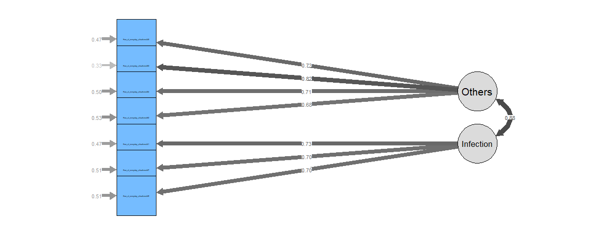<!-- -->

``` r
# dev.off()
```

This indicates a problem however - the two factors are now correlated at
.88, which is problematic. This suggests that there is a large degree of
overlap between the two factors, and while there is clearly some
evidence for a two factor structure, it is not clear.

In order to select the most parsimonious model, we therefore select the
one factor model, which still demonstrates excellent fit to the data.

``` r
# pdf('../figures/1factor_model.pdf')
semPaths(cfa_fit_1f_item_removed, what = "std", whatLabels = "std", 
         residuals = TRUE, intercepts = FALSE,
         # prettify
         fade = TRUE, sizeMan=8, layout='tree', rotation=4, curve=2,
         style = "lisrel", sizeLat = 8, 
         nCharNodes = 50, 
         edge.label.cex = 0.5, edge.color='#4a4a4a',
         color = list(lat = rgb(219, 219, 219, maxColorValue = 255), 
                      man = rgb(117, 188, 255, maxColorValue = 255)))
```

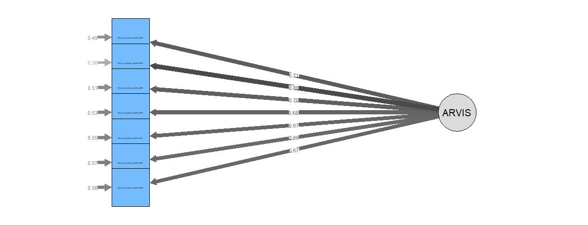<!-- -->

``` r
# dev.off()
```

Let’s get the factor loadings for both these models.

``` r
parameterEstimates(cfa_fit_2f_item_removed, standardized=TRUE) %>% 
             filter(op == "=~") %>% 
             select('Latent Factor'=lhs, Indicator=rhs, B=est, SE=se, Z=z, Beta=std.all)
```

    ##   Latent Factor                      Indicator         B         SE        Z
    ## 1        Others Fear_of_everyday_situations445 0.9140378 0.06201893 14.73805
    ## 2        Others Fear_of_everyday_situations453 0.9780664 0.05631458 17.36791
    ## 3        Others Fear_of_everyday_situations454 0.8124687 0.05745777 14.14028
    ## 4        Others Fear_of_everyday_situations462 0.7882232 0.05841523 13.49345
    ## 5     Infection Fear_of_everyday_situations441 0.8075056 0.05677340 14.22331
    ## 6     Infection Fear_of_everyday_situations447 0.6830258 0.05080699 13.44354
    ## 7     Infection Fear_of_everyday_situations449 0.7788585 0.05788906 13.45433
    ##        Beta
    ## 1 0.7294439
    ## 2 0.8205241
    ## 3 0.7073405
    ## 4 0.6827300
    ## 5 0.7283213
    ## 6 0.6966355
    ## 7 0.6970766

``` r
parameterEstimates(cfa_fit_1f_item_removed, standardized=TRUE) %>% 
             filter(op == "=~") %>% 
             select('Latent Factor'=lhs, Indicator=rhs, B=est, SE=se, Z=z, Beta=std.all)
```

    ##   Latent Factor                      Indicator         B         SE        Z
    ## 1         ARVIS Fear_of_everyday_situations445 0.8923592 0.06210672 14.36816
    ## 2         ARVIS Fear_of_everyday_situations453 0.9505212 0.05646095 16.83502
    ## 3         ARVIS Fear_of_everyday_situations454 0.8064595 0.05721018 14.09643
    ## 4         ARVIS Fear_of_everyday_situations462 0.7905337 0.05798070 13.63443
    ## 5         ARVIS Fear_of_everyday_situations441 0.7451805 0.05600586 13.30540
    ## 6         ARVIS Fear_of_everyday_situations447 0.6435114 0.04987792 12.90173
    ## 7         ARVIS Fear_of_everyday_situations449 0.7445463 0.05658700 13.15755
    ##        Beta
    ## 1 0.7121434
    ## 2 0.7974159
    ## 3 0.7021088
    ## 4 0.6847312
    ## 5 0.6721078
    ## 6 0.6563337
    ## 7 0.6663672

``` r
estimates <- standardizedsolution(cfa_fit_1f_item_removed)
estimates
```

    ##                               lhs op                            rhs est.std
    ## 1                           ARVIS =~ Fear_of_everyday_situations445   0.712
    ## 2                           ARVIS =~ Fear_of_everyday_situations453   0.797
    ## 3                           ARVIS =~ Fear_of_everyday_situations454   0.702
    ## 4                           ARVIS =~ Fear_of_everyday_situations462   0.685
    ## 5                           ARVIS =~ Fear_of_everyday_situations441   0.672
    ## 6                           ARVIS =~ Fear_of_everyday_situations447   0.656
    ## 7                           ARVIS =~ Fear_of_everyday_situations449   0.666
    ## 8  Fear_of_everyday_situations445 ~~ Fear_of_everyday_situations445   0.493
    ## 9  Fear_of_everyday_situations453 ~~ Fear_of_everyday_situations453   0.364
    ## 10 Fear_of_everyday_situations454 ~~ Fear_of_everyday_situations454   0.507
    ## 11 Fear_of_everyday_situations462 ~~ Fear_of_everyday_situations462   0.531
    ## 12 Fear_of_everyday_situations441 ~~ Fear_of_everyday_situations441   0.548
    ## 13 Fear_of_everyday_situations447 ~~ Fear_of_everyday_situations447   0.569
    ## 14 Fear_of_everyday_situations449 ~~ Fear_of_everyday_situations449   0.556
    ## 15                          ARVIS ~~                          ARVIS   1.000
    ##       se      z pvalue ci.lower ci.upper
    ## 1  0.031 22.749      0    0.651    0.773
    ## 2  0.025 31.714      0    0.748    0.847
    ## 3  0.032 21.930      0    0.639    0.765
    ## 4  0.033 20.605      0    0.620    0.750
    ## 5  0.034 19.708      0    0.605    0.739
    ## 6  0.035 18.660      0    0.587    0.725
    ## 7  0.034 19.318      0    0.599    0.734
    ## 8  0.045 11.054      0    0.405    0.580
    ## 9  0.040  9.080      0    0.286    0.443
    ## 10 0.045 11.278      0    0.419    0.595
    ## 11 0.046 11.671      0    0.442    0.620
    ## 12 0.046 11.960      0    0.458    0.638
    ## 13 0.046 12.328      0    0.479    0.660
    ## 14 0.046 12.093      0    0.466    0.646
    ## 15 0.000     NA     NA    1.000    1.000

``` r
write.csv(estimates, '../data/final_cfa_model_estimates.csv')
```

This results in a 7-item, unidimensional scale.

Finally, we check the reliability of this measure

``` r
final_data <- validation_data %>% select(c('Fear_of_everyday_situations445', 'Fear_of_everyday_situations453', 
                                           'Fear_of_everyday_situations454', 'Fear_of_everyday_situations462',
                                           'Fear_of_everyday_situations441', 'Fear_of_everyday_situations447',
                                           'Fear_of_everyday_situations449'))

omega(final_data)
```

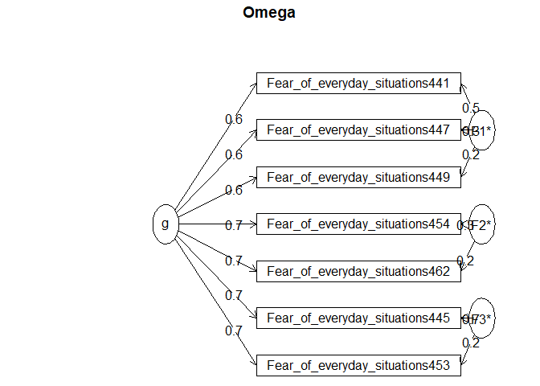<!-- -->

    ## Omega 
    ## Call: omegah(m = m, nfactors = nfactors, fm = fm, key = key, flip = flip, 
    ##     digits = digits, title = title, sl = sl, labels = labels, 
    ##     plot = plot, n.obs = n.obs, rotate = rotate, Phi = Phi, option = option, 
    ##     covar = covar)
    ## Alpha:                 0.87 
    ## G.6:                   0.86 
    ## Omega Hierarchical:    0.78 
    ## Omega H asymptotic:    0.86 
    ## Omega Total            0.9 
    ## 
    ## Schmid Leiman Factor loadings greater than  0.2 
    ##                                   g   F1*   F2*   F3*   h2   u2   p2
    ## Fear_of_everyday_situations445 0.67              0.69 0.93 0.07 0.49
    ## Fear_of_everyday_situations453 0.73              0.24 0.63 0.37 0.85
    ## Fear_of_everyday_situations454 0.71        0.33       0.62 0.38 0.82
    ## Fear_of_everyday_situations462 0.65        0.20       0.48 0.52 0.88
    ## Fear_of_everyday_situations441 0.64  0.51             0.67 0.33 0.62
    ## Fear_of_everyday_situations447 0.60  0.30             0.46 0.54 0.78
    ## Fear_of_everyday_situations449 0.62  0.23             0.45 0.55 0.84
    ## 
    ## With eigenvalues of:
    ##    g  F1*  F2*  F3* 
    ## 3.07 0.42 0.20 0.55 
    ## 
    ## general/max  5.62   max/min =   2.7
    ## mean percent general =  0.75    with sd =  0.14 and cv of  0.19 
    ## Explained Common Variance of the general factor =  0.72 
    ## 
    ## The degrees of freedom are 3  and the fit is  0 
    ## The number of observations was  341  with Chi Square =  1.65  with prob <  0.65
    ## The root mean square of the residuals is  0.01 
    ## The df corrected root mean square of the residuals is  0.02
    ## RMSEA index =  0  and the 10 % confidence intervals are  0 0.073
    ## BIC =  -15.85
    ## 
    ## Compare this with the adequacy of just a general factor and no group factors
    ## The degrees of freedom for just the general factor are 14  and the fit is  0.19 
    ## The number of observations was  341  with Chi Square =  62.51  with prob <  4.2e-08
    ## The root mean square of the residuals is  0.07 
    ## The df corrected root mean square of the residuals is  0.08 
    ## 
    ## RMSEA index =  0.101  and the 10 % confidence intervals are  0.076 0.127
    ## BIC =  -19.13 
    ## 
    ## Measures of factor score adequacy             
    ##                                                  g   F1*   F2*  F3*
    ## Correlation of scores with factors            0.89  0.62  0.44 0.84
    ## Multiple R square of scores with factors      0.79  0.38  0.19 0.71
    ## Minimum correlation of factor score estimates 0.58 -0.23 -0.61 0.43
    ## 
    ##  Total, General and Subset omega for each subset
    ##                                                  g  F1*  F2*  F3*
    ## Omega total for total scores and subscales    0.90 0.76 0.70 0.86
    ## Omega general for total scores and subscales  0.78 0.58 0.61 0.60
    ## Omega group for total scores and subscales    0.08 0.18 0.09 0.26

This is a little lower before, but still very good - \(\alpha\) = .87
and \(\omega\) = .9

## Convergent and divergent validity

Next we check the validity of the scale - how well does it predict
scores on other measures.

First we get the data and combine it with our existing data

``` r
validity_data <- read.csv('../data/arvis_other_measures.csv')
subjectID <- validation_data$subjectID
final_data_id <- cbind(final_data, subjectID)

validity_data <- merge(validity_data, final_data_id, by='subjectID')
validity_data <- merge(validity_data, validation_data %>% select(!contains('Fear_')), by='subjectID')
```

Then calculate sum scores on the different questionnaire measures

``` r
ARVIS_scores <- rowSums(validity_data %>% select(contains('Fear_')))
STICSA_scores <- rowSums(validity_data %>% select(contains('STICSA')))
BDI_scores <- rowSums(validity_data %>% select(contains('Depression')))
SHAI_scores <- rowSums(validity_data %>% select(contains('Health_')))
SIA_scores <- rowSums(validity_data %>% select(contains('Social_interaction_')))
SPQ_scores <- rowSums(validity_data %>% select(contains('Social_phobia')))
OASIS_scores <- rowSums(validity_data %>% select(contains('OASIS')))

convergent_validity_df <- cbind(ARVIS_scores, STICSA_scores, OASIS_scores, BDI_scores, SHAI_scores, SIA_scores, SPQ_scores)
write.csv(convergent_validity_df, '../data/convergent_validity_df.csv', row.names = FALSE)
```

We can then look at the correlations between these items

``` r
rcorr(convergent_validity_df)
```

    ##               ARVIS_scores STICSA_scores OASIS_scores BDI_scores SHAI_scores
    ## ARVIS_scores          1.00          0.17         0.28       0.15        0.26
    ## STICSA_scores         0.17          1.00         0.65       0.74        0.59
    ## OASIS_scores          0.28          0.65         1.00       0.65        0.49
    ## BDI_scores            0.15          0.74         0.65       1.00        0.53
    ## SHAI_scores           0.26          0.59         0.49       0.53        1.00
    ## SIA_scores            0.10          0.46         0.33       0.38        0.36
    ## SPQ_scores            0.07          0.41         0.31       0.38        0.42
    ##               SIA_scores SPQ_scores
    ## ARVIS_scores        0.10       0.07
    ## STICSA_scores       0.46       0.41
    ## OASIS_scores        0.33       0.31
    ## BDI_scores          0.38       0.38
    ## SHAI_scores         0.36       0.42
    ## SIA_scores          1.00       0.74
    ## SPQ_scores          0.74       1.00
    ## 
    ## n= 272 
    ## 
    ## 
    ## P
    ##               ARVIS_scores STICSA_scores OASIS_scores BDI_scores SHAI_scores
    ## ARVIS_scores               0.0061        0.0000       0.0105     0.0000     
    ## STICSA_scores 0.0061                     0.0000       0.0000     0.0000     
    ## OASIS_scores  0.0000       0.0000                     0.0000     0.0000     
    ## BDI_scores    0.0105       0.0000        0.0000                  0.0000     
    ## SHAI_scores   0.0000       0.0000        0.0000       0.0000                
    ## SIA_scores    0.1177       0.0000        0.0000       0.0000     0.0000     
    ## SPQ_scores    0.2625       0.0000        0.0000       0.0000     0.0000     
    ##               SIA_scores SPQ_scores
    ## ARVIS_scores  0.1177     0.2625    
    ## STICSA_scores 0.0000     0.0000    
    ## OASIS_scores  0.0000     0.0000    
    ## BDI_scores    0.0000     0.0000    
    ## SHAI_scores   0.0000     0.0000    
    ## SIA_scores               0.0000    
    ## SPQ_scores    0.0000

While none of these correlations are especially high, the highest are
with health anxiety (SHAI) and state anxiety (OASIS), as expected.

The most important check here though is whether the correlations differ
significantly between the convergent measures (SHAI, OASIS) and
divergent measures (BDI, SIA, SPQ). Here we test this

``` r
cc_OASIS_STICSA <- cocor(~ARVIS_scores + OASIS_scores | ARVIS_scores + STICSA_scores, convergent_validity_df, return.htest=TRUE)
cc_OASIS_BDI <- cocor(~ARVIS_scores + OASIS_scores | ARVIS_scores + BDI_scores, convergent_validity_df, return.htest=TRUE)
cc_OASIS_SIA <- cocor(~ARVIS_scores + OASIS_scores | ARVIS_scores + SIA_scores, convergent_validity_df, return.htest=TRUE)
cc_OASIS_SPQ <- cocor(~ARVIS_scores + OASIS_scores | ARVIS_scores + SPQ_scores, convergent_validity_df, return.htest=TRUE)

cc_SHAI_STICSA <- cocor(~ARVIS_scores + SHAI_scores | ARVIS_scores + STICSA_scores, convergent_validity_df, return.htest=TRUE)
cc_SHAI_BDI <- cocor(~ARVIS_scores + SHAI_scores | ARVIS_scores + BDI_scores, convergent_validity_df, return.htest=TRUE)
cc_SHAI_SIA <- cocor(~ARVIS_scores + SHAI_scores | ARVIS_scores + SIA_scores, convergent_validity_df, return.htest=TRUE)
cc_SHAI_SPQ <- cocor(~ARVIS_scores + SHAI_scores | ARVIS_scores + SPQ_scores, convergent_validity_df, return.htest=TRUE)
```

``` r
measures_OASIS <- c('cc_OASIS_STICSA', 'cc_OASIS_BDI', 'cc_OASIS_SIA', 'cc_OASIS_SPQ')

OASIS_zs <- c()
OASIS_ps <- c()

for (q in measures_OASIS) {
  cc <- get(q)
  z <- cc$hittner2003$statistic
  p <- cc$hittner2003$p.value
  
  OASIS_zs <- rbind(OASIS_zs, z)
  OASIS_ps <- rbind(OASIS_ps, p)
}

OASIS_cc_df <- as.data.frame(cbind(measures_OASIS, OASIS_zs, OASIS_ps))
colnames(OASIS_cc_df) <- c('Measures', 'Z', 'pval')

measures_SHAI <- c('cc_SHAI_STICSA', 'cc_SHAI_BDI', 'cc_SHAI_SIA', 'cc_SHAI_SPQ')

SHAI_zs <- c()
SHAI_ps <- c()

for (q in measures_SHAI) {
  cc <- get(q)
  z <- cc$hittner2003$statistic
  p <- cc$hittner2003$p.value
  
  SHAI_zs <- rbind(SHAI_zs, z)
  SHAI_ps <- rbind(SHAI_ps, p)
}

SHAI_cc_df <- as.data.frame(cbind(measures_SHAI, SHAI_zs, SHAI_ps))
colnames(SHAI_cc_df) <- c('Measures', 'Z', 'pval')
```

``` r
OASIS_cc_df
```

    ##            Measures                Z                pval
    ## z   cc_OASIS_STICSA  2.3436011282539  0.0190985839100863
    ## z.1    cc_OASIS_BDI 2.59751169441044  0.0093901922692905
    ## z.2    cc_OASIS_SIA 2.72099283798949 0.00650861716453521
    ## z.3    cc_OASIS_SPQ 3.06869876392286 0.00214993256831053

``` r
SHAI_cc_df
```

    ##           Measures                Z                pval
    ## z   cc_SHAI_STICSA 1.74720502580592  0.0806017802613088
    ## z.1    cc_SHAI_BDI  1.8256331854248  0.0679055335972807
    ## z.2    cc_SHAI_SIA 2.43998712202516    0.01468778549503
    ## z.3    cc_SHAI_SPQ 2.99155506916567 0.00277560471801319

``` r
write.csv(OASIS_cc_df, '../data/OASIS_cc_df.csv', row.names = FALSE)
write.csv(SHAI_cc_df, '../data/SHAI_cc_df.csv', row.names = FALSE)
```

This demonstrates that the correlation between our measure (ARVIS) and
the OASIS are significantly higher than the divergent validity measures.
Correlations between the ARVIS and the SHAI are significantly higher
than with the social anxiety measures, but not quite significant with
the STICSA and BDI.

### Correlations with COVID threat

In the original sample, we have data for the 10-item COVID threat scale

``` r
covid_threat_data <- data.frame(data %>% select(c('Fear_of_everyday_situations445', 'Fear_of_everyday_situations453', 
                                               'Fear_of_everyday_situations454', 'Fear_of_everyday_situations462',
                                               'Fear_of_everyday_situations441', 'Fear_of_everyday_situations447',
                                               'Fear_of_everyday_situations449')), data %>% select(contains('Pandemic_effects')))
S1_ARVIS_scores <- rowSums(covid_threat_data %>% select(contains('Fear_')))
S1_Symbolic_threat_scores <- rowSums(covid_threat_data %>% select(c('Pandemic_effects468', 'Pandemic_effects469', 'Pandemic_effects470', 'Pandemic_effects471', 'Pandemic_effects472')))
S1_Realistic_threat_scores <- rowSums(covid_threat_data %>% select(c('Pandemic_effects473', 'Pandemic_effects474', 'Pandemic_effects475', 'Pandemic_effects476', 'Pandemic_effects477')))

S1_convergent_validity_df <- cbind(S1_ARVIS_scores, S1_Symbolic_threat_scores, S1_Realistic_threat_scores)
```

``` r
rcorr(S1_convergent_validity_df)
```

    ##                            S1_ARVIS_scores S1_Symbolic_threat_scores
    ## S1_ARVIS_scores                       1.00                     -0.19
    ## S1_Symbolic_threat_scores            -0.19                      1.00
    ## S1_Realistic_threat_scores            0.27                      0.21
    ##                            S1_Realistic_threat_scores
    ## S1_ARVIS_scores                                  0.27
    ## S1_Symbolic_threat_scores                        0.21
    ## S1_Realistic_threat_scores                       1.00
    ## 
    ## n= 236 
    ## 
    ## 
    ## P
    ##                            S1_ARVIS_scores S1_Symbolic_threat_scores
    ## S1_ARVIS_scores                            0.0037                   
    ## S1_Symbolic_threat_scores  0.0037                                   
    ## S1_Realistic_threat_scores 0.0000          0.0011                   
    ##                            S1_Realistic_threat_scores
    ## S1_ARVIS_scores            0.0000                    
    ## S1_Symbolic_threat_scores  0.0011                    
    ## S1_Realistic_threat_scores

This shows a dissociation between the two subscales of the COVID threat
measure - interestingly the ARVIS is anticorrelated with symbolic threat

We can check that the difference between correlations is significant
again

``` r
cc_Symbolic_Realistic_threat <- cocor(~S1_ARVIS_scores + S1_Symbolic_threat_scores | S1_ARVIS_scores + S1_Realistic_threat_scores, S1_convergent_validity_df, return.htest=TRUE)
cc_Symbolic_Realistic_threat$hittner2003
```

    ## 
    ##  Hittner, May, and Silver's (2003) modification of Dunn and Clark's z
    ##  (1969) using a backtransformed average Fisher's (1921) Z procedure
    ## 
    ## data:  S1_convergent_validity_df: j = S1_ARVIS_scores, k = S1_Symbolic_threat_scores, h = S1_Realistic_threat_scores
    ## z = -5.6479, p-value = 1.624e-08
    ## alternative hypothesis: true difference in correlations is not equal to 0
    ## sample estimates:
    ##       r.jk       r.jh       r.kh 
    ## -0.1880823  0.2681083  0.2105753

## Criterion validity

Finally we check criterion validity, that is whether the measure
predicts an outcome that should be associated with it. For this, we use
measures of self-reported protective behaviours. While this isn’t
perfect - it’s self report rather than an objective measure (which would
be difficult to acquire), it allows us to test whether virus-related
fear predicts a behavioural outcome.

``` r
avoiding_social <- validity_data$Behavior26
handwashing <- validity_data$Behavior29
staying_home <- validity_data$Behavior30

behaviour <- cbind(ARVIS_scores, avoiding_social, handwashing, staying_home)

write.csv(behaviour, '../data/behaviour_df.csv', row.names = FALSE)

rcorr(behaviour, type='spearman')
```

    ##                 ARVIS_scores avoiding_social handwashing staying_home
    ## ARVIS_scores            1.00            0.43        0.29         0.27
    ## avoiding_social         0.43            1.00        0.32         0.51
    ## handwashing             0.29            0.32        1.00         0.39
    ## staying_home            0.27            0.51        0.39         1.00
    ## 
    ## n= 272 
    ## 
    ## 
    ## P
    ##                 ARVIS_scores avoiding_social handwashing staying_home
    ## ARVIS_scores                  0               0           0          
    ## avoiding_social  0                            0           0          
    ## handwashing      0            0                           0          
    ## staying_home     0            0               0

All of these are highly significant.

## Test-retest reliability - Study 3

First get the time 2 data

``` r
retest_data <- read.csv('../data/arvis_wide_retest.csv')

T1_scores <- rowSums(reduced_data %>% select(contains('Fear_')) %>% select(-c('Fear_of_everyday_situations460')))
T1_scores <- data.frame(T1_scores, subjectID=data$subjectID)

T2_scores <- rowSums(retest_data %>% select(contains('Fear_')))
T2_scores <- data.frame(T2_scores, subjectID=retest_data$subjectID)

retest_scores <- merge(T1_scores, T2_scores)
write.csv(retest_scores, '../data/retest_scores.csv', row.names = FALSE)

# Number of subjects completing both time points
nrow(retest_scores)
```

    ## [1] 202

Check internal consistency at T2

``` r
omega(retest_data %>% select(contains('Fear_')))
```

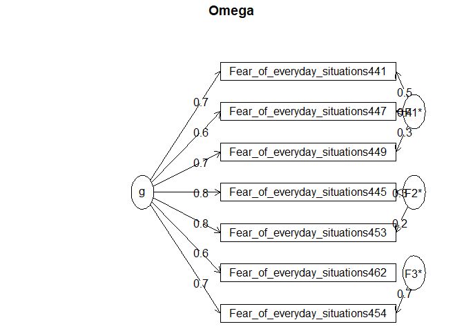<!-- -->

    ## Omega 
    ## Call: omegah(m = m, nfactors = nfactors, fm = fm, key = key, flip = flip, 
    ##     digits = digits, title = title, sl = sl, labels = labels, 
    ##     plot = plot, n.obs = n.obs, rotate = rotate, Phi = Phi, option = option, 
    ##     covar = covar)
    ## Alpha:                 0.9 
    ## G.6:                   0.89 
    ## Omega Hierarchical:    0.83 
    ## Omega H asymptotic:    0.89 
    ## Omega Total            0.93 
    ## 
    ## Schmid Leiman Factor loadings greater than  0.2 
    ##                                   g   F1*   F2*   F3*   h2   u2   p2
    ## Fear_of_everyday_situations441 0.70  0.54             0.78 0.22 0.63
    ## Fear_of_everyday_situations445 0.80        0.27       0.72 0.28 0.90
    ## Fear_of_everyday_situations447 0.63  0.36             0.53 0.47 0.75
    ## Fear_of_everyday_situations449 0.73  0.30             0.63 0.37 0.84
    ## Fear_of_everyday_situations453 0.83        0.23       0.74 0.26 0.92
    ## Fear_of_everyday_situations454 0.73              0.69 1.00 0.00 0.53
    ## Fear_of_everyday_situations462 0.60                   0.43 0.57 0.85
    ## 
    ## With eigenvalues of:
    ##    g  F1*  F2*  F3* 
    ## 3.64 0.52 0.17 0.50 
    ## 
    ## general/max  6.99   max/min =   3.1
    ## mean percent general =  0.77    with sd =  0.15 and cv of  0.19 
    ## Explained Common Variance of the general factor =  0.75 
    ## 
    ## The degrees of freedom are 3  and the fit is  0.01 
    ## The number of observations was  260  with Chi Square =  1.78  with prob <  0.62
    ## The root mean square of the residuals is  0.01 
    ## The df corrected root mean square of the residuals is  0.01
    ## RMSEA index =  0  and the 10 % confidence intervals are  0 0.086
    ## BIC =  -14.9
    ## 
    ## Compare this with the adequacy of just a general factor and no group factors
    ## The degrees of freedom for just the general factor are 14  and the fit is  0.27 
    ## The number of observations was  260  with Chi Square =  70.05  with prob <  1.9e-09
    ## The root mean square of the residuals is  0.07 
    ## The df corrected root mean square of the residuals is  0.09 
    ## 
    ## RMSEA index =  0.124  and the 10 % confidence intervals are  0.096 0.154
    ## BIC =  -7.8 
    ## 
    ## Measures of factor score adequacy             
    ##                                                  g  F1*   F2*  F3*
    ## Correlation of scores with factors            0.92 0.72  0.41 0.91
    ## Multiple R square of scores with factors      0.85 0.51  0.17 0.83
    ## Minimum correlation of factor score estimates 0.70 0.02 -0.67 0.66
    ## 
    ##  Total, General and Subset omega for each subset
    ##                                                  g  F1*  F2*  F3*
    ## Omega total for total scores and subscales    0.93 0.84 0.83 1.00
    ## Omega general for total scores and subscales  0.83 0.63 0.76 0.53
    ## Omega group for total scores and subscales    0.08 0.21 0.07 0.47

Still high, \(\alpha\) = .9, \(\omega\) = .93.

Calculate Pearson’s R between T1 and T2

``` r
cor.test(retest_scores$T1_scores, retest_scores$T2_scores)
```

    ## 
    ##  Pearson's product-moment correlation
    ## 
    ## data:  retest_scores$T1_scores and retest_scores$T2_scores
    ## t = 26.927, df = 200, p-value < 2.2e-16
    ## alternative hypothesis: true correlation is not equal to 0
    ## 95 percent confidence interval:
    ##  0.8513220 0.9119206
    ## sample estimates:
    ##       cor 
    ## 0.8853245

This gives a highly significant \(r\) of .89.

Next we calculate ICC(A,1)

``` r
## Code taken from Pike et al., (2020)

icc_a1<-icc(cbind(retest_scores$T1_scores, retest_scores$T2_scores),model = "twoway",
    type = "agreement",
    unit = "single", 
    r0 = 0,
    conf.level = 0.95)

icc_a1
```

    ##  Single Score Intraclass Correlation
    ## 
    ##    Model: twoway 
    ##    Type : agreement 
    ## 
    ##    Subjects = 202 
    ##      Raters = 2 
    ##    ICC(A,1) = 0.885
    ## 
    ##  F-Test, H0: r0 = 0 ; H1: r0 > 0 
    ##  F(201,202) = 16.4 , p = 2.62e-69 
    ## 
    ##  95%-Confidence Interval for ICC Population Values:
    ##   0.851 < ICC < 0.912

And ICC(C,1)

``` r
icc_c1<-icc(cbind(retest_scores$T1_scores, retest_scores$T2_scores),model = "twoway",
    type = "consistency",
    unit = "single", 
    r0 = 0,
    conf.level = 0.95)

icc_c1
```

    ##  Single Score Intraclass Correlation
    ## 
    ##    Model: twoway 
    ##    Type : consistency 
    ## 
    ##    Subjects = 202 
    ##      Raters = 2 
    ##    ICC(C,1) = 0.885
    ## 
    ##  F-Test, H0: r0 = 0 ; H1: r0 > 0 
    ##  F(201,201) = 16.4 , p = 4.88e-69 
    ## 
    ##  95%-Confidence Interval for ICC Population Values:
    ##   0.851 < ICC < 0.912

Both of these are excellent (i.e. \> .75) and highly significant

Finally weplot the relationship between T1 and T2 scores

``` r
lm_eqn <- function(x,y){
    m <- lm(y ~ x);
    eq <- substitute(italic(y) == a + b %.% italic(x)*","~~italic(r)^2~"="~r2, 
         list(a = format(unname(coef(m)[1]), digits = 2),
              b = format(unname(coef(m)[2]), digits = 2),
             r2 = format(summary(m)$r.squared, digits = 3)))
    as.character(as.expression(eq));
}


ggplot(data=retest_scores,aes(x=T1_scores,y=T2_scores))+
  geom_point()+
  labs(x='Score time 1',y='Score time 2')+
  geom_smooth(method = "lm", se=FALSE, color="black", formula = y ~ x)+
  geom_text(x = 5, y = 25, label = lm_eqn(retest_scores$T1_scores,retest_scores$T2_scores), parse = TRUE)
```

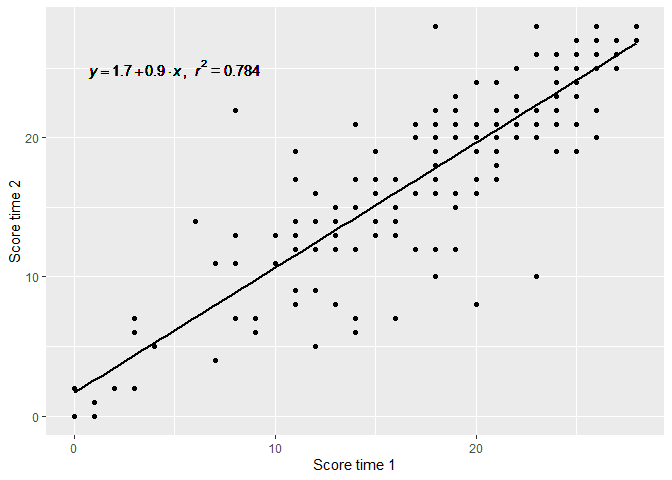<!-- -->
